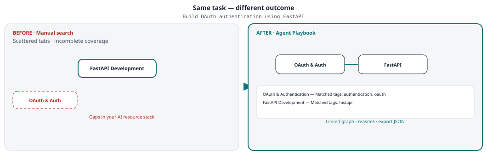
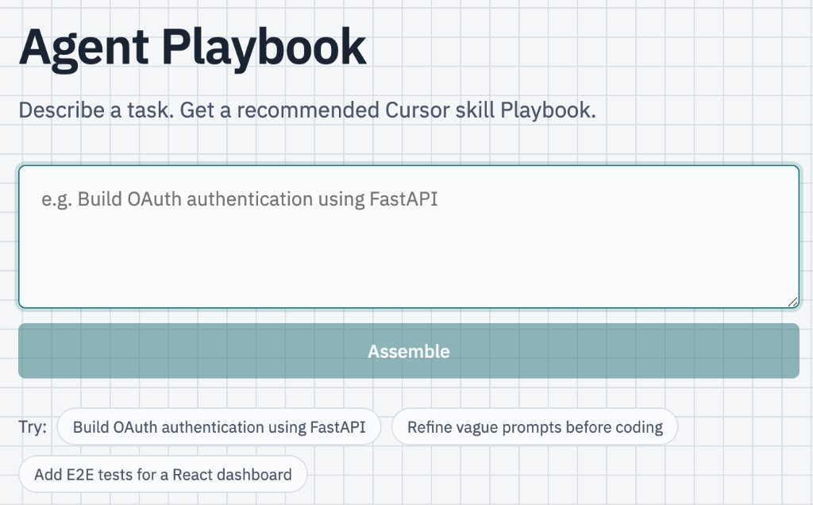
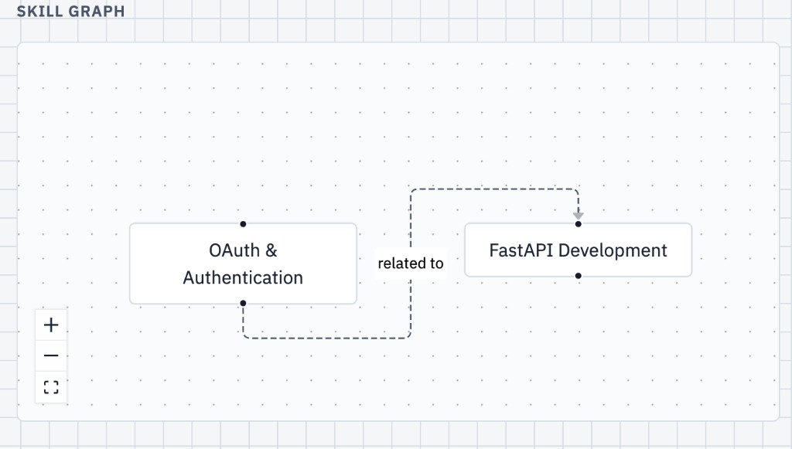

# Agent Playbook

> **Discover. Visualize. Assemble. Export.**

Agent Playbook is an open-source **metadata catalog and recommendation engine** for AI development resources. Describe an engineering task, get a ranked resource set with explainable reasons, explore how resources relate, and export a reusable playbook — without redistributing third-party content.

**Resource types** include Cursor rules, Claude skills, MCP servers, AGENTS.md, templates, prompts, and future formats. The v0.1 catalog is Cursor-heavy; the architecture is ecosystem-agnostic.

**Author:** [zllabs](https://github.com/zllabs) · MIT licensed · personal project ([contributions policy](CONTRIBUTING.md))

## Before & After

Same engineering task — two very different outcomes.

**Task:** *Build OAuth authentication using FastAPI*



| Before | After |
|--------|-------|
| Search GitHub, directories, and docs separately | Enter one task → get a ranked resource set |
| Find FastAPI rules, **miss OAuth and related resources** | **Discover connected resources** via catalog graph |
| No idea how resources relate | **Visual graph** shows `related_to` / `requires` links |
| No reasons, no export | **Explainable reasons** + **playbook.json** export |
| Start coding with gaps in your AI stack | Start with a **linked, explainable resource set** |

## Problem

Developers have access to Cursor rules, Claude skills, MCP servers, AGENTS.md, prompt libraries, templates, and community catalogs — but choosing which resources to use, in what order, and which work together is still manual.

## Why Agent Playbook

Unlike GitHub search, Agent Playbook provides:

- **Task-specific recommendations** — ranked resources matched to your engineering task
- **Explainable reasons** — why each resource is included
- **Resource relationship graphs** — curated edges between related entries
- **Reusable playbook exports** — download `playbook.json` for sharing or tooling

## Demo

**Example task:** Build OAuth authentication using FastAPI *(v0.1 demo uses Cursor rule metadata from the community catalog)*

**Home — task entry:**



**Result — resource graph:**



**Example Playbook output:** [docs/demo/playbook.example.json](docs/demo/playbook.example.json)

```json
{
  "title": "Build OAuth Authentication Using Playbook",
  "task": "Build OAuth authentication using FastAPI",
  "skills": [
    {
      "id": "oauth-security",
      "title": "OAuth & Authentication",
      "reason": "Matched tags: authentication, oauth.",
      "source_url": "https://github.com/sanjeed5/awesome-cursor-rules-mdc/blob/main/rules-mdc/auth0.mdc",
      "license": "CC0-1.0"
    },
    {
      "id": "fastapi-skill",
      "title": "FastAPI Development",
      "reason": "Matched tags: fastapi.",
      "source_url": "https://github.com/sanjeed5/awesome-cursor-rules-mdc/blob/main/rules-mdc/fastapi.mdc",
      "license": "CC0-1.0"
    }
  ],
  "edges": [
    { "from": "oauth-security", "to": "fastapi-skill", "type": "related_to" }
  ]
}
```

## Quick start

```bash
./dev.sh
```

Opens API (`:8000`) and web (`:5173`) in one process — Ctrl+C stops both. First run creates the venv and installs deps. Override with `API_PORT` / `WEB_PORT` if needed.

Open http://127.0.0.1:5173 — see [apps/README.md](apps/README.md) for manual two-terminal setup.

### Install into Cursor or Claude

On the result screen, pick **Cursor** or **Claude Code**, then **This project** or **All projects**, and click **Install**. Only matching ecosystem resources are written (Claude skills never land in `.cursor/`, Cursor rules never land in `.claude/`).

Local packages with both `cursor/` and `claude/` variants install the matching side.

> **Note:** v0.1 is a local-dev tool. See [SECURITY.md](SECURITY.md).

## Documentation

| Doc | Description |
|-----|-------------|
| [docs/architecture.md](docs/architecture.md) | System design, stack, data model |
| [docs/adding-resources.md](docs/adding-resources.md) | Catalog rules (for forks and local use) |
| [CONTRIBUTING.md](CONTRIBUTING.md) | Project status and local development |
| [CHANGELOG.md](CHANGELOG.md) | Release notes |

## Repository layout

```
skills/                  # original local packages only (see skills/README.md)
apps/
  api/                   # FastAPI backend
  web/                   # React frontend
data/
  catalog.json           # curated external resource metadata + edges
  custom_skills.example.json  # seed for local custom entries (copied on first run)
docs/
  architecture.md
  adding-resources.md
  demo/                  # example exports + release screenshots
```

## Local resource packages

Original rules and skills shipped with this repo — not copies from third-party catalogs. Each package is self-contained and MIT-licensed unless noted otherwise.

| Package | Cursor rule | Claude skill | Description |
|---------|-------------|--------------|-------------|
| [prompt-refiner](skills/prompt-refiner/) | [rule.mdc](skills/prompt-refiner/cursor/rule.mdc) | [SKILL.md](skills/prompt-refiner/claude/SKILL.md) | Compile vague requests into structured briefs |

Add a new package under `skills/` — see [skills/README.md](skills/README.md).

## Reference hubs

The catalog indexes metadata pointing at community and official hubs (see [data/sources.json](data/sources.json)):

| Resource | URL |
|----------|-----|
| Awesome Cursor Rules (MDC) | [github.com/sanjeed5/awesome-cursor-rules-mdc](https://github.com/sanjeed5/awesome-cursor-rules-mdc) |
| Cursor Skills docs | [cursor.com/docs/context/skills](https://cursor.com/docs/context/skills) |
| Cursor Rules docs | [cursor.com/docs/context/rules](https://cursor.com/docs/context/rules) |
| Claude Code Skills | [code.claude.com/docs/en/skills](https://code.claude.com/docs/en/skills) |
| Matt Pocock Skills (flattened) | [github.com/mattpocock/skills](https://github.com/mattpocock/skills) |
| Anthropic Skills (flattened) | [github.com/anthropics/skills](https://github.com/anthropics/skills) |
| Agent Skills standard | [agentskills.io](https://agentskills.io) |

See [data/sources.json](data/sources.json) for the full hub list.

> Official documentation links are provided as references only. Copyright remains with their respective owners.

## Catalog rules

- **Source URL required** — every catalog entry must link to the canonical resource
- **License required** — SPDX identifier when available; otherwise `Documentation (copyright)` or `Unknown (see source)` for official documentation sites and community hubs
- **Attribution required** — author / maintainer field
- **No redistribution of third-party content** — Agent Playbook stores only metadata (title, description, license, tags, attribution, canonical URLs, and relationships)

Details: [docs/adding-resources.md](docs/adding-resources.md)

## Third-party resources

Third-party resources remain the intellectual property of their respective authors.

Agent Playbook stores only metadata necessary for discovery, attribution, and recommendation — titles, descriptions, authors, licenses, canonical URLs, tags, and relationships.

If you are the author of a listed resource and would like it updated or removed, [open an issue](https://github.com/zllabs/agent-brief/issues).

## Tests

```bash
python -m tests
cd apps/api && .venv/bin/python test_recommend.py
cd apps/api && .venv/bin/python test_recommend_eval.py
```

## License

MIT — see [LICENSE](LICENSE). Catalog entries retain their upstream licenses; this project stores attribution only.
