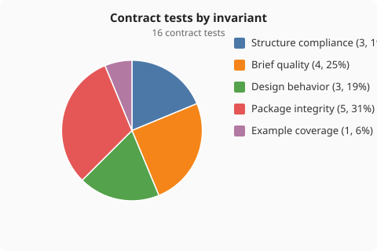
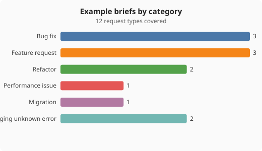
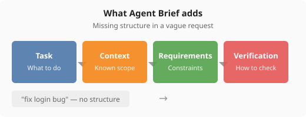

# Agent Brief

**I write sloppy requests. This makes my agent understand me better.**

A lightweight agent instruction that transforms vague developer requests into concise coding-agent briefs.

Agent Brief is not trying to make smarter prompts. It removes ambiguity between developers and coding agents.

---

## The problem

You type a vague request. Your agent guesses scope, approach, and success criteria.

```
fix login bug  →  ???  →  clarification loops, wrong turns
```

Agent Brief compiles sloppy requests into a fixed structure so agents can plan and execute with less guessing.

---

## Install

### Cursor

```bash
mkdir -p .cursor/rules
cp agent-brief/cursor/rules/agent-brief.md .cursor/rules/agent-brief.mdc
```

Type your request normally. The rule applies passively on underspecified requests:

```
fix login bug                 # compiled into a brief
rename function foo to bar    # left alone
```

### Claude Code

```bash
mkdir -p ~/.claude/skills
cp -r agent-brief/claude/skills/agent-brief ~/.claude/skills/
```

```
/agent-brief make API faster
```

---

## Examples

**Input:**

```
fix login bug
```

**Agent Brief:**

```
Task:
Fix the login bug.

Context:
Investigate the authentication flow.

Requirements:

Make minimal changes.
Preserve existing behavior.
Add or update tests if applicable.

Verification:
Run relevant tests.
```

| Category | Sample requests |
|----------|-----------------|
| Bug fix | `fix login bug`, `fix the memory leak` |
| Feature request | `add authentication`, `add dark mode` |
| Refactor | `refactor this`, `clean up this file` |
| Performance | `make API faster` |
| Migration | `run the migration` |
| Debugging | `app crashes on startup`, `something broke in prod` |

See [examples.md](examples.md) for 14 transformations, plus clarification and skip cases.

---

## Design goals

Agent Brief follows five rules:

| | Rule |
|---|------|
| 1 | Add structure, not verbosity |
| 2 | Preserve user intent |
| 3 | Never invent context |
| 4 | Prefer clarification over assumptions |
| 5 | Keep generated briefs short |

### Token-aware by design

Coding agents already receive system instructions, repository context, tool definitions, and project rules.

Agent Brief only adds missing execution details.

---

## What's in the box

| File | Purpose |
|------|---------|
| `cursor/rules/agent-brief.md` | Cursor rule — passive intent compilation |
| `claude/skills/agent-brief/SKILL.md` | Claude Code skill — explicit `/agent-brief` |
| `examples.md` | Request → brief transformations by category |
| `tests/` | Contract validation for brief quality |

---

## Tests

Agent Brief includes contract tests to ensure generated briefs follow the design principles.

```bash
cd agent-brief
python -m tests
```

```
Ran 16 tests in 0.002s

OK
```

The tests verify **implementation quality** — not agent task completion or coding performance.

### What the tests check

| Check | Validates |
|-------|-----------|
| Required sections are present | Task, Context, Requirements, Verification |
| Briefs stay concise | Word limits enforced |
| No role-play fluff is added | No "you are an expert..." padding |
| No context is invented | No fabricated file paths or details |
| Ambiguous requests trigger clarification | Questions, not fake briefs |
| Clear requests are not unnecessarily expanded | Specific requests are skipped |

> The tool itself is reliable. Whether your agent completes the task faster is something you evaluate in your own workflow.

### Test coverage



16 contract tests grouped by invariant type: structure compliance, brief quality, design behavior, package integrity, and example coverage.

### Example coverage



14 example briefs across six request categories — the same situations developers actually type.

### What gets added



A vague request has no objective, constraints, or verification. Agent Brief adds only the missing execution structure.

Regenerate charts after running tests:

```bash
python -m tests report
```

---

## What this is not (v1)

Agent Brief intentionally focuses on one problem: turning vague developer requests into concise agent-ready instructions.

Not included:

- CLI
- VS Code/Cursor extension
- Prompt library
- Prompt evaluation
- Analytics
- RAG or context retrieval
- Autonomous task planning

---

## Success metric

Install it. Type a vague request. Your coding agent produces a better plan or code with fewer clarification loops.
